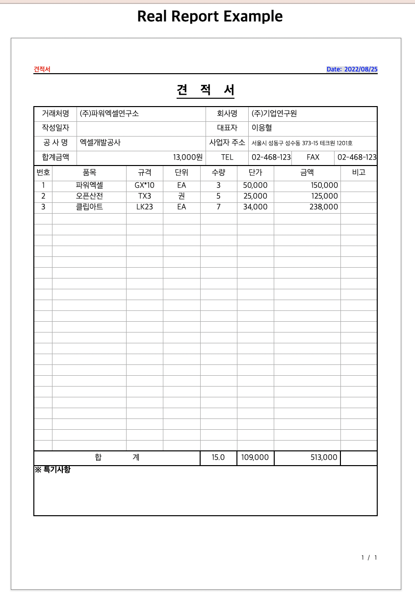

# SpringBoot JSP RealReport 예제

- 스프링부트, JSP 환경에서의 리얼리포트 예제를 다룹니다

# 프로젝트 실행방법

### 메이븐 의존성 설치

```shell
./mvnw install
```
### 스프링 부트 스크립트 실행

```shell
./mvnw spring-boot:run
```
- 스크립트 실행 후, `http://localhost:8080/`해당 경로로 접속해주세요

### 결과화면

  

# 프로젝트 간단소개

### JSP 설정

- `src/main/resources/application.properties`에 있는 설정을 참고해주시면 됩니다
- 해당 설정으로 jsp파일의 경로 및 suffix를 설정합니다.
- 덕분에 컨트롤러에서 `return "index";`이렇게 리턴해도 jsp파일을 찾아서 응답할 수 있습니다.

### 컨트롤러

- `src/main/java/com/example/realreport/web/IndexController.java`에 있습니다.
